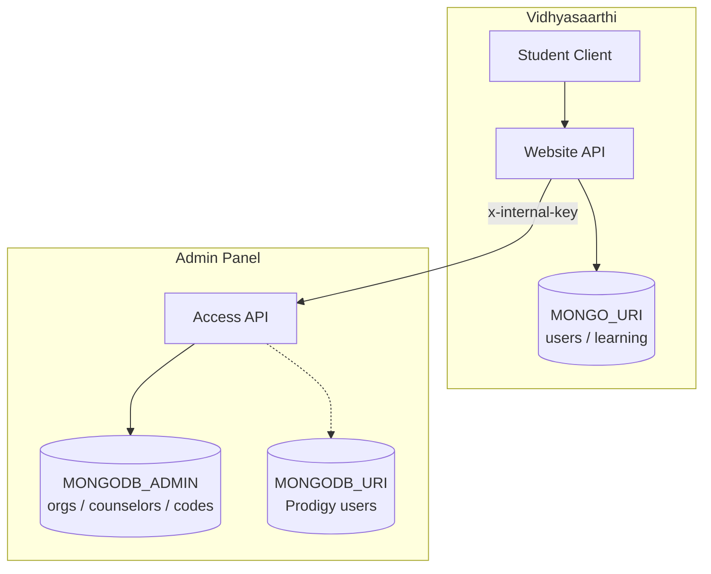

# Access Control Integration Architecture

## System overview

## Folder responsibilities

| Area | Owns |
|------|------|
| `adminpanel_guidopia/server` Access models/services | Orgs, counselors, referral codes, RBAC, ownership `students` |
| `adminpanel_guidopia/client` Access UI | Super/org/counselor management |
| `vidhyasarthi/.../backend` | Google auth, onboarding, learning data, User linkage cache |
| `vidhyasarthi/.../client` | Student UX |

## Registration flow

1. Google OAuth → Vidhya `User`
2. Optional referral on onboarding
3. `GET /api/access/referral/validate`
4. `POST /api/access/students/register` (`name`, `email`, `phone?`, `referralCode?`)
5. Admin returns student with `organizationId` / `assignedCounselorId`
6. Vidhya persists linkage on `User`
7. Invalid code → register again without code (default org, unassigned) + warn client

## Referral flow

- Codes generated only when Admin creates/regenerates a counselor
- Stored on Admin `counselors.referralCode`
- Validated only via Admin API
- Vidhya never generates or looks up codes in its own DB

## Auth flow

- **Students:** Vidhya JWT after Google
- **Access Control staff:** Admin `/api/access/auth/login` (`typ: access`)
- **Prodigy Users admins:** Admin `/api/auth/login`

## API contract

See [ACCESS_API.md](./ACCESS_API.md) — S2S section.

## Required environment variables

### Admin

| Var | Required | Purpose |
|-----|----------|---------|
| `MONGODB_ADMIN` | yes | Access Control DB |
| `MONGODB_URI` | yes | Prodigy |
| `INTERNAL_REGISTER_KEY` | yes in prod | S2S auth |
| `DEFAULT_ORGANIZATION_ID` | recommended | No-referral placement |
| `JWT_SECRET` | yes | Tokens |
| `CORS_ORIGIN` | recommended | Frontends |

### Vidhyasaarthi

| Var | Required | Purpose |
|-----|----------|---------|
| `MONGO_URI` | yes | Platform users / learning |
| `ADMIN_API_URL` | yes | Admin base URL |
| `INTERNAL_REGISTER_KEY` | yes in prod | Must match Admin |
| `JWT_SECRET` / Google OAuth | yes | Student auth |
